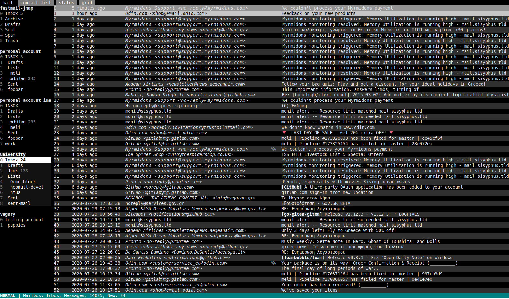

# meli [](https://github.com/meli/meli/blob/master/COPYING) [](https://crates.io/crates/meli) [](ircs://irc.oftc.net:6697/%23meli)

**BSD/Linux terminal email client with support for multiple accounts and Maildir / mbox / notmuch / IMAP / JMAP / NNTP (usenet).**

Community links:
[mailing lists](https://lists.meli.delivery/) | `#meli` on OFTC IRC | Report bugs and/or feature requests in [meli's issue tracker](https://git.meli.delivery/meli/meli/issues "meli gitea issue tracker")

Main repository: <https://git.meli.delivery/meli/meli>

Official mirrors: <https://github.com/meli/meli>

| | | |
:---:|:---:|:---:
  |   | 
Main view             |  Compact main view | Compose with embed terminal editor

## Description

meli aims for configurability, extensibility with sane defaults, and modern
practices. It is a mail client for both casual and power users of the terminal.

A variety of email workflows and software stacks should be usable with meli.
Integrate e-mail storage, sync, tagging system, SMTP client, contact management
and editor of your choice to replace the defaults.


### Supported E-mail backends

| Protocol     | Support         |
|:------------:|:----------------|
| IMAP         | full            |
| Maildir      | full            |
| notmuch      | full*           |
| mbox         | read-only       |
| JMAP         | functional      |
| NNTP / Usenet| functional      |


* there's no support for searching through all email directly, you'd have to
  create a mailbox with a notmuch query that returns everything and search
  inside that mailbox.

### E-mail Submission backends
--------------------------

- SMTP
- Pipe to shell script
- Server-side submission

### Non-exhaustive List of Features

- TLS
- email threading support
- multithreaded, async operation
- optionally run your editor of choice inside meli, with an embedded
  xterm-compatible terminal emulator
- plain text configuration in TOML
- ability to open emails in UI tabs and switch to them
- optional sqlite3 index search
- override almost any setting per mailbox, per account
- contact list (+read-only vCard and mutt alias file support)
- forced UTF-8 (other encodings are read-only)
- configurable shortcuts
- theming
- `NO_COLOR` support
- ascii-only drawing characters option
- view text/html attachments through an html filter command (w3m by default)
- pipe attachments/mail to stuff
- use external attachment file picker instead of typing in an attachment's full path
- GPG signing, encryption, signing + encryption
- GPG signature verification

## Install
- Try an [online interactive web demo](https://meli.delivery/wasm2.html "online interactive web demo") powered by WebAssembly
- Pre-built binaries for [pkgsrc](https://pkgsrc.se/mail/meli) and [openbsd ports](https://openports.pl/path/mail/meli).
- `cargo install --git https://git.meli.delivery/meli/meli.git meli`
- [Download and install pre-built debian package, static linux binary](https://github.com/meli/meli/releases/ "github releases for meli"), or
- Install with [Nix](https://search.nixos.org/packages?show=meli&query=meli&from=0&size=30&sort=relevance&channel=unstable#disabled "nixos package search results for 'meli'").

## Documentation

See a comprehensive tour of `meli` in the manual page [`meli(7)`](./meli/docs/meli.7).

See also the [Quickstart tutorial](https://meli.delivery/documentation.html#quick-start) online.

After installing `meli`, see `meli(1)`, `meli.conf(5)`, `meli(7)` and `meli-themes(5)` for documentation.
Sample configuration and theme files can be found in the `meli/docs/samples/` subdirectory.
Manual pages are also [hosted online](https://meli.delivery/documentation.html "meli documentation").

`meli` by default looks for a configuration file in this location: `$XDG_CONFIG_HOME/meli/config.toml`

You can run meli with arbitrary configuration files by setting the `$MELI_CONFIG` environment variable to their locations, i.e.:

```sh
MELI_CONFIG=./test_config cargo run
```

## Build
For a quick start, build and install locally:

```sh
 PREFIX=~/.local make install
```

Available subcommands for `make` are listed with `make help`.
The Makefile *should* be POSIX portable and not require a specific `make` version.

`meli` requires rust 1.65 and rust's package manager, Cargo.
Information on how to get it on your system can be found here: <https://doc.rust-lang.org/cargo/getting-started/installation.html>

With Cargo available, the project can be built with `make` and the resulting binary will then be found under `target/release/meli`.
Run `make install` to install the binary and man pages.
This requires root, so I suggest you override the default paths and install it in your `$HOME`: `make PREFIX=$HOME/.local install`.

You can build and run `meli` with one command: `cargo run --release`.

### Build features

Some functionality is held behind "feature gates", or compile-time flags. The following list explains each feature's purpose:

- `gpgme` enables GPG support via `libgpgme` (on by default)
- `dbus-notifications` enables showing notifications using `dbus` (on by default)
- `notmuch` provides support for using a notmuch database as a mail backend (on by default)
- `jmap` provides support for connecting to a jmap server and use it as a mail backend (on by default)
- `sqlite3` provides support for builting fast search indexes in local sqlite3 databases (on by default)
- `cli-docs` includes the manpage documentation compiled by either `mandoc` or `man` binary to plain text in `meli`'s command line. Embedded documentation can be viewed with the subcommand `meli man [PAGE]` (on by default).
- `regexp` provides experimental support for theming some e-mail fields based
  on regular expressions.
  It uses the `pcre2` library.
  Since it's actual use in the code is very limited, it is not recommended to use this (off by default).
- `static` and `*-static` bundle C libraries in dependencies so that you don't need them installed in your system (on by default).

### Build Debian package (*deb*)

Building with Debian's packaged cargo might require the installation of these two packages: `librust-openssl-sys-dev librust-libdbus-sys-dev`

A `*.deb` package can be built with `make deb-dist`

### Using notmuch

To use the optional notmuch backend feature, you must have `libnotmuch5` installed in your system.
In Debian-like systems, install the `libnotmuch5` packages.
`meli` detects the library's presence on runtime.

### Using GPG

To use the optional gpg feature, you must have `libgpgme` installed in your system.
In Debian-like systems, install the `libgpgme11` package.
`meli` detects the library's presence on runtime.

### HTML Rendering

HTML rendering is achieved using [w3m](https://github.com/tats/w3m) by default.
You can use the `pager.html_filter` setting to override this (for more details you can consult [`meli.conf(5)`](./meli/docs/meli.conf.5)).

# Development

Development builds can be built and/or run with

```
cargo build
cargo run
```

There is a debug/tracing log feature that can be enabled by using the flag `--feature debug-tracing` after uncommenting the features in `Cargo.toml`.
The logs are printed in stderr when the env var `MELI_DEBUG_STDERR` is defined, thus you can run `meli` with a redirection (i.e `2> log`).

Code style follows the `rustfmt.toml` file.
